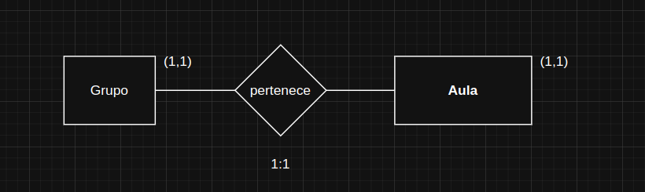

# BBDD recap

> 10/30/2025

#### Relaciones entre entidades
 
RELACIONES X:0  
En el caso de 0 la correspondencia o participacion de la entidad es opcional  

RELACIONES 1:1   
 A cada elemento de la 1era entidad le corresponde 1 de la segunda y viceversa

RELACIONES 1:N  
 A cada elemento de la 1era entidad le corresponde uno o mas elementos de la 2da entidad,y cada elemento de la 2nda le corresponde a 1 de la 1era

1 grupo alumonos 1 aula
